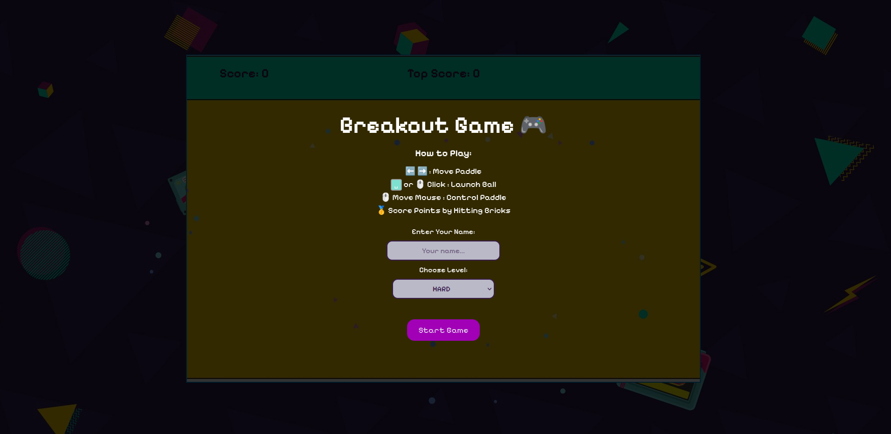

# Breakout Game

A simple implementation of the classic *Breakout* arcade game built with JavaScript, HTML and CSS.  
Your goal is to break all the bricks using the ball while keeping it from falling off the screen with your paddle.

---

## How to Play

- *Move the Paddle*  
  - Use the *Right Arrow* → to move right.  
  - Use the *Left Arrow* ← to move left.  
  - Or, move your *mouse left and right* to control the paddle.

- *Launch the Ball*  
  - Press the *Spacebar* to launch the ball.  
  - Or, use a *Left Mouse Click* to launch the ball.

Keep the ball bouncing and destroy all the bricks to win!

---

## Preview

Add a screenshot or gameplay GIF here:

  


---

## Features

- *Multiple Difficulty Levels*  
  Choose between *Easy, **Normal, and **Hard*. The higher the difficulty, the more bricks appear.  

- *Power-Ups*  
  - *Wider Paddle* – Gives you more control to keep the ball in play.  
  - *Extra Life* – Stay in the game longer.  

- *Flexible Controls*  
  Play with either keyboard or mouse.
  
---

##  Setup

1. Clone this repository:  
   ```bash
   git clone https://github.com/aserelnaghy/breakout-game.git

---

## Project Tree

breakout-game
├─ assets
│  ├─ images
│  │  ├─ bg.jpg
│  │  ├─ bg2.jpg
│  │  ├─ bg3.jpg
│  │  ├─ brick1.jpg
│  │  ├─ brick10.jpg
│  │  ├─ brick11.jpg
│  │  ├─ brick2.jpg
│  │  ├─ brick3.jpg
│  │  ├─ brick4.jpg
│  │  ├─ brick5.jpg
│  │  ├─ brick6.jpg
│  │  ├─ brick7.jpg
│  │  ├─ brick8.jpg
│  │  ├─ brick9.jpg
│  │  ├─ extraLife.png
│  │  ├─ home.jpg
│  │  ├─ spacebar.png
│  │  └─ widePaddle.png
│  └─ sounds
│     ├─ bgmusic.mp3
│     ├─ brick-paddle-hit.mp3
│     ├─ gameover.mp3
│     ├─ launchball.mp3
│     ├─ loselife.mp3
│     ├─ menu-soft-select.mp3
│     └─ menu-soft-unselect.mp3
├─ css
│  └─ style.css
├─ font
│  └─ SuperPixel-m2L8j.ttf
├─ index.html
├─ js
│  ├─ collision.js
│  ├─ gameState.js
│  ├─ input.js
│  ├─ levels.js
│  ├─ motion.js
│  ├─ objects.js
│  ├─ powerups.js
│  ├─ script.js
│  ├─ sound.js
│  └─ state.js
├─ main.js
└─ README.md
